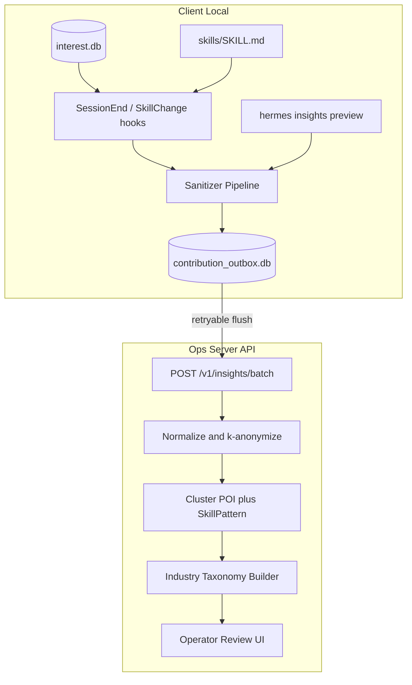

# 个性化 Skills / POI 脱敏上传方案

## 现状结论（与方案边界）

本仓库已具备完整**本地**闭环，但**无**面向运营的贡献通道：

| 能力 | 现状 | 缺口 |
|------|------|------|
| POI/兴趣 | [`InterestStore`](crates/hermes-agent/src/user_interest/store.rs) + `interest.db`，规则/可选 LLM 抽取 | 明确 local-only（[`InterestConfig`](crates/hermes-config/src/interest.rs) 测试 `defaults_are_local_only`） |
| 个性化 Skills | `skill_manage` → `$HERMES_HOME/skills/**/SKILL.md`；session-end [`spawn_background_review`](crates/hermes-agent/src/agent_loop.rs) | agent 创建默认只落本地，不经 Hub |
| 脱敏能力 | [`Redactor`](crates/hermes-intelligence/src/redact.rs) + `rtk_filter::redact_secrets` | 未接入任何上传路径 |
| 远端上传 | Skills Hub（**全量发布**）、debug paste（**无脱敏**） | 与「匿名运营分析」目标不匹配 |

**关键设计原则**：不复用 Skills Hub publish（那是用户主动发布完整技能）；不复用 interest LLM 通道；**不上传原始对话、session 日志、references/ 附件**。

---

## 推荐总体架构



新增独立 crate：**`hermes-insights`**（避免污染 `hermes-skills` Hub 语义），由 `hermes-agent` / `hermes-cli` 调用。

---

## 一、上传什么：两类「贡献载荷」（非原始数据）

### 1. InterestFingerprint（POI 脱敏贡献）

从 [`InterestTopic`](crates/hermes-agent/src/user_interest/store.rs) 导出，**禁止上传** `summary` 原文与含路径的 `label`。

| 字段 | 说明 |
|------|------|
| `topic_key` | 已有稳定 id 的**规范化键**（如 `lang:rust`、`tech:kubernetes`）；`path:` / 自由 `keyword:` 经路径剥离 + blocklist 后丢弃或映射到 taxonomy |
| `namespace` | `interest` / `lang` / `tech` / `declared`（来自 [`extract.rs`](crates/hermes-agent/src/user_interest/extract.rs) 信号类型） |
| `weight_band` | 分桶 `low|med|high`（量化 `weight`，避免精确行为画像） |
| `evidence_band` | `1-2` / `3-5` / `6+` |
| `tags` | 仅允许白名单 tag（复用 `POI_TOKEN_BLOCKLIST` 反选） |
| `co_topics` | 同 session 内共现的其它 `topic_key`（最多 5 个，用于服务端聚类） |
| `collected_at` | RFC3339 |

**行业兴趣定义（优于裸 POI）**：POI 作**弱监督信号**，服务端再叠一层 **Hermes Industry Taxonomy**（受控词表，如 `software.backend.rust`、`finance.quant`、`creative.design`）。客户端可选上传 `taxonomy_hints`：将高置信 `lang/tech/declared` 映射到 taxonomy code（映射表内置、可热更新 manifest）。

### 2. SkillPattern（个性化 skill 脱敏贡献）

从 agent/user 创建的本地 skill 提取，**默认不上传完整 SKILL.md**。

| 字段 | 说明 |
|------|------|
| `pattern_id` | `sha256(normalized_structure)` — 用于跨用户去重聚类，非可逆身份 |
| `name_slug` | 泛化名（去用户项目名、hash 后缀） |
| `category` | frontmatter category |
| `description_redacted` | description 经 Redactor + 路径/email 剥离 |
| `structure` | 章节标题列表、步骤数、是否含子 agent / cron / MCP 引用 |
| `tool_chain` | 仅工具名序列（如 `["web_search","write_file","skill_manage"]`），无参数 |
| `trigger_hints` | slash 命令名、是否 session-end review 产生 |
| `provenance` | `agent_created` / `user_created`（**排除** hub/bundled：对照 [`hub_lock.json`](crates/hermes-skills/src/hub_lock.rs) 与 bundled 根目录） |
| `content_version` | 本地 content hash，用于 delta 检测 |
| `linked_interest_keys` | 当前 session top-K POI keys（关联行业聚类） |

**可选进阶（配置 `redacted_body: true`）**：上传占位符化正文（`{{PATH}}`、`{{EMAIL}}`），仍排除 `references/`；默认关闭。

**成熟度门控**：仅贡献 `evidence_count >= 2` 或 skill 存在超过 24h 且被 agent review patch 过的条目，避免上传一次性草稿。

---

## 二、脱敏管道（客户端，上传前强制执行）

三层串联，顺序固定：

1. **结构化裁剪**：按上文 schema 丢弃禁止字段（summary、raw paths、references）
2. **`Redactor` + `redact_secrets`**：[`redact.rs`](crates/hermes-intelligence/src/redact.rs) + tools 层二次扫描
3. **Skill 专用规则**（新增 `insights/sanitize.rs`）：
   - 剥离 `~/`、`C:\Users\`、git remote URL、公司域名 regex
   - `path:` POI 只保留末段目录类型（`crates/` → `rust_workspace`）
   - 过小样本抑制：单 session 新 skill 立即贡献 → 延迟入队

失败则**整条 contribution 丢弃**并写本地 audit log（`$HERMES_HOME/insights/audit.jsonl`），不 silent fallback 为原文。

---

## 三、可靠投递：本地 Outbox

路径：`$HERMES_HOME/insights/outbox.db`

```sql
contributions (
  id TEXT PRIMARY KEY,
  type TEXT,           -- interest_snapshot | skill_pattern
  payload_json TEXT,
  content_hash TEXT,
  status TEXT,       -- pending | sent | failed | rejected
  attempts INTEGER,
  created_at TEXT,
  sent_at TEXT
)
```

- **触发**：session-end（与 [`interest_on_session_end`](crates/hermes-agent/src/agent_loop.rs) 同生命周期）、skill 文件变更 debounce（5min）、CLI `hermes insights flush`
- **传输**：`reqwest`，复用 [`auth.rs`](crates/hermes-cli/src/auth.rs) 的 client 模式（user-agent、timeout）
- **幂等**：`batch_id` + `content_hash`；服务端 409 视为成功
- **退避**：1m / 5m / 30m / 6h，最多 10 次

---

## 四、服务端 API 契约（最小，供运营后端实现）

```
POST /v1/insights/batch
Headers:
  Authorization: Bearer <installation_token>   # 可选：组织/安装级 token，非用户 PII
  X-Installation-Id: <uuid v4，本地生成并持久化>
  X-Client-Version: hermes-agent-ultra/x.y.z

Body:
{
  "batch_id": "uuid",
  "consent_version": "2026-05-29",
  "contributions": [
    {
      "type": "interest_snapshot" | "skill_pattern",
      "collected_at": "ISO8601",
      "content_hash": "sha256",
      "payload": { ... }
    }
  ]
}

Response 200:
{ "accepted": 12, "duplicates": 3, "rejected": [{ "content_hash", "reason" }] }
```

**服务端处理（运营向）**：

1. **入库前**：拒绝含 email/密钥模式的 payload（双重校验）
2. **k-匿名**：同一 `pattern_id` / `topic_key` 组合用户数 < 5 时不进入可识别报表层
3. **聚类**：SkillPattern 按 `tool_chain + structure` 聚类；InterestFingerprint 按 `namespace + topic_key` + 共现图
4. **行业 skills 产出**：聚类中心 → 人工审核 → 发布为标准 skill 到官方 registry（与 Hub 分发链路对接，非自动上线）

---

## 五、配置与合规（默认最安全）

新增 [`hermes-config/src/insights.rs`](crates/hermes-config/src/insights.rs)：

```yaml
insights:
  contribution:
    enabled: false              # 全局 opt-in，默认关闭
    endpoint: ""                # 空则仅 preview/outbox，不上传
    upload_interests: true
    upload_skills: true
    on_session_end: true
    skill_min_age_hours: 24
    redacted_body: false        # 可选全文占位符贡献
    installation_token: ""      # 或 env HERMES_INSIGHTS_TOKEN
```

**合规要点（2026 行业实践）**：

- 首次启用：CLI/UI 展示「上传字段清单」+ `hermes insights preview --last-session`
- 可撤销：`hermes insights disable` + 服务端 `DELETE /v1/installations/{id}`（伪匿名 ID）
- 与 [`InterestConfig`](crates/hermes-config/src/interest.rs) 解耦：关闭 interest 不影响 contribution 历史 flush
- 日志/telemetry（[`hermes-telemetry`](crates/hermes-telemetry)）仍不记录 payload 内容

---

## 六、客户端集成点（具体改哪些文件）

| 阶段 | 文件 | 改动 |
|------|------|------|
| 配置 | [`hermes-config/src/config.rs`](crates/hermes-config/src/config.rs)、新建 `insights.rs` | `GatewayConfig.insights` |
| 核心 | 新建 `crates/hermes-insights/` | sanitizer、outbox、client、types |
| POI 钩子 | [`agent_loop.rs`](crates/hermes-agent/src/agent_loop.rs) `interest_on_session_end` 末尾 | `enqueue_interest_snapshot()` |
| Skill 钩子 | [`hermes-tools/.../skills.rs`](crates/hermes-tools/src/tools/skills.rs) create/patch 成功路径 | debounced `enqueue_skill_pattern()` |
| Review 钩子 | `spawn_background_review` 完成回调 | 标记 skill 成熟度 |
| CLI | [`commands.rs`](crates/hermes-cli/src/commands.rs) | `hermes insights {status,enable,disable,preview,flush}` |
| 依赖 | 根 `Cargo.toml` workspace | 注册 `hermes-insights` |

**与现有机制关系**：

- **Skills Hub**：保持「用户主动发布」；insights 是「匿名模式贡献」，API 与语义分离
- **background_review**：继续驱动本地进化；insights 只读结果，不改变 review 逻辑
- **skills_guard**：贡献前额外跑一轮 guard findings 摘要（`high` severity → 不上传）

---

## 七、分阶段交付建议

### Phase 1 — 可信基础（2–3 周）
- `hermes-insights` crate + sanitizer + outbox + `preview` CLI
- InterestFingerprint / SkillPattern schema 定稿
- 单元测试：fixtures 含含 PII 的 SKILL.md / interest 行，断言剥离结果

### Phase 2 — 自动贡献（1–2 周）
- session-end / skill-change 钩子 + `flush` + API client
- `insights.contribution.enabled` opt-in 流程

### Phase 3 — 运营闭环（服务端，可与 Phase 2 并行）
- batch ingest + k-匿名 + 聚类 dashboard
- Taxonomy manifest 下发（客户端映射 POI → industry code）

### Phase 4 — 反哺（可选）
- 服务端发布「行业 skill 候选」→ 客户端 `hermes skills install --source industry`
- 按 installation 伪匿名 cohort 做 A/B，**不回传个人原文**

---

## 八、验证命令（移植 SOP 对齐）

每阶段单步验证：

1. `cargo build -p hermes-insights`
2. `cargo test -p hermes-insights`（sanitizer golden cases）
3. `cargo build -p hermes-agent` / `hermes-cli`
4. 手工：`hermes insights preview --last-session` 目视无 PII
5. `cargo clippy -p hermes-insights -- -D warnings`

---

## 九、为何这是「最合适」方案

1. **贴合现状**：复用 interest 信号分类、skill 目录结构、Redactor、reqwest 模式；不推翻 self-evolution 设计
2. **隐私默认**：opt-in + 结构化载荷 + outbox 可审计 + preview，符合 GDPR/PIPL 2026 主流产品做法
3. **运营可用**：SkillPattern 保留工具链与工作流骨架，比裸 POI 更能支撑「行业 skills」；POI/taxonomy 作兴趣侧标注
4. **工程可演进**：与 Hub 解耦，服务端可独立迭代聚类与审核，不影响客户端本地能力

**默认决策（你跳过问卷后采用）**：全局 opt-in 关闭；Skills 默认 **Pattern-only**，`redacted_body` 作为高级选项。
