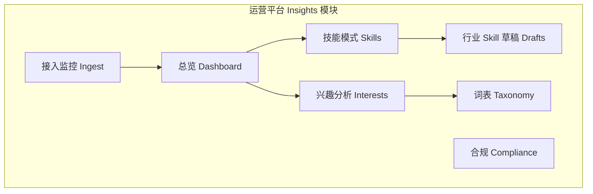
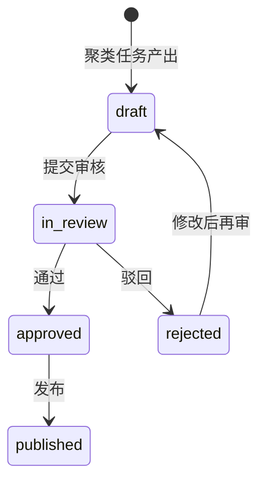

# Insights 运营平台 — 前端展示规格

> **读者**：运营平台前端 + Go 内网 Admin API 开发。  
> **数据基础**：见 [SERVER_IMPLEMENTATION.md](./SERVER_IMPLEMENTATION.md) 三张核心表 + OSS。  
> **客户端贡献形态**：见 [CLIENT_IMPLEMENTATION.md](./CLIENT_IMPLEMENTATION.md)（`interest_snapshot` / `skill_pattern`）。

---

## 1. 鉴权（与 Hermes 客户端区分）

| 调用方 | 鉴权方式 |
|--------|----------|
| **Hermes 客户端** | `Authorization: Bearer <用户 JWT 或 flowy- API Key>` + `X-Installation-Id` → `/v1/insights/*` |
| **运营平台前端** | 现有运营登录态（SSO / Cookie / 内网 JWT）→ `/admin/api/v1/insights/*` |

运营 UI **不要**复用客户端的 `installation_token` 配置；内网 Admin API 走独立权限（见 §6 RBAC）。

---

## 2. 设计原则（展示什么、不展示什么）

| 原则 | UI 要求 |
|------|---------|
| **只展示脱敏数据** | 列表/详情不出现邮箱、密钥、`/home/...`、完整 SKILL 原文 |
| **安装级明细受限** | 单条贡献可给运营排障，但**默认列表按聚合**；`installation_id` 列表页仅显示前 8 位 + `…`（点击需权限展开） |
| **k-匿名门槛** | 兴趣排行、技能聚类、共现图：仅当 `distinct_installations >= K`（默认 5）才展示具体 topic/pattern；否则显示「样本不足」 |
| **撤销即时反映** | `revoked_at` 非空的安装：贡献在运营侧标为「已撤销」，聚合统计中排除 |
| **OSS 大字段** | `payload_json` 为空时，详情页通过 presigned URL 或后端代理拉取，**不在列表接口返回全文** |

---

## 3. 信息架构（导航）



| 菜单 | Phase | 说明 |
|------|-------|------|
| **总览** | P0 | 今日入库量、拒绝率、活跃安装数 |
| **接入监控** | P0 | Batch / 拒绝原因 / 单条贡献排障 |
| **兴趣分析** | P1 | Topic cohort、共现、与 taxonomy 对齐 |
| **技能模式** | P1 | Pattern 目录、工具链分布、关联兴趣 |
| **行业 Skill 草稿** | P2 | 聚类产出的待审核稿 → 发布 |
| **词表管理** | P2 | Taxonomy manifest 版本 |
| **合规** | P0 | 撤销安装、删除任务状态 |

---

## 4. 页面规格

### 4.1 总览 Dashboard（P0）

**目的**：运营一眼看到管道是否健康。

**卡片指标**（时间范围：今日 / 7 天 / 30 天切换）

| 指标 | 数据来源 | 展示 |
|------|----------|------|
| 入库贡献数 | `insights_raw_contributions` WHERE `deleted_at IS NULL` | 数字 + 环比 |
| 活跃安装数 | `COUNT(DISTINCT installation_id)` | 数字 |
| Batch 数 | `insights_ingest_batches` | 数字 |
| 拒绝率 | batch 表 `rejected_count / (accepted+duplicate+rejected)` 或接入日志 | 百分比 + 趋势折线 |
| POI vs Skill 占比 | `contribution_type` GROUP BY | 环形图 |
| Top 拒绝原因 | 接入日志或临时表 | 条形图：`pii_detected`、`schema_violation`… |

**不下钻到**单安装明文 ID（仅聚合）。

---

### 4.2 接入监控 Ingest（P0）

#### 4.2.1 Batch 列表

**表格列**

| 列 | 字段 |
|----|------|
| 接收时间 | `insights_ingest_batches.received_at` |
| Batch ID | `batch_id`（可复制， monospace） |
| 安装 | `installation_id` 掩码 + tooltip 完整（需权限） |
| Consent | `consent_version` |
| 接受 / 重复 / 拒绝 | `accepted_count` / `duplicate_count` / `rejected_count` |
| 客户端版本 | JOIN `insights_installations.client_version` |

**筛选**：日期范围、consent 版本、仅含拒绝 `rejected_count > 0`。

**行点击** → Batch 详情。

#### 4.2.2 Batch 详情

```
┌─────────────────────────────────────────────────────────┐
│ Batch 550e8400-...    2026-05-29 12:00 UTC              │
│ 安装: inst-abcd…    Consent: 2026-05-29                 │
│ 接受 8 · 重复 2 · 拒绝 1                                 │
├─────────────────────────────────────────────────────────┤
│ 贡献列表                                                 │
│ ┌──────┬──────────────────┬────────────┬──────────────┐ │
│ │ 类型 │ content_hash 前8 │ collected  │ 操作         │ │
│ ├──────┼──────────────────┼────────────┼──────────────┤ │
│ │ POI  │ a1b2c3d4…        │ 12:00      │ [查看]       │ │
│ │ Skill│ e5f6…            │ 12:00      │ [查看]       │ │
│ └──────┴──────────────────┴────────────┴──────────────┘ │
└─────────────────────────────────────────────────────────┘
```

#### 4.2.3 贡献详情（排障用，权限 `insights:read_raw`）

按 `contribution_type` 分两种布局。

**A. `interest_snapshot`**

| 区块 | 内容 |
|------|------|
| 元信息 | `content_hash`、`collected_at`、`received_at`、是否 OSS |
| Topic 表 | 列：`topic_key`、`namespace`、`weight_band`、`evidence_band`、`tags`、`taxonomy_hints` |
| 共现 | `co_topics` 标签组 |
| 原始 JSON | 折叠面板；若 `oss_object_key` 有值，按钮「从 OSS 加载」 |

**B. `skill_pattern`**

| 区块 | 内容 |
|------|------|
| 标识 | `pattern_id`、`name_slug`、`category`、`content_version` |
| 结构 | `structure`：step_count、headings 列表、subagent/cron/mcp 图标 |
| 工具链 | `tool_chain` 标签 |
| 触发 | `trigger_hints.slash_command`、`from_background_review` |
| 来源 | `provenance` badge |
| 关联兴趣 | `linked_interest_keys` → 可点击跳转兴趣分析（P1） |
| 描述 | `description_redacted`（纯文本，禁止 HTML 渲染以防 XSS） |
| 正文 | 仅当存在 `oss_body_key`：单独 Tab「脱敏正文」，后端代理或 presigned |

---

### 4.3 兴趣分析 Interests（P1）

**目的**：从大量 `interest_snapshot` 归纳行业兴趣分布（非单用户画像）。

#### 3.3.1 Topic 排行

**表格**（仅 `distinct_installations >= K` 的行）

| 列 | 说明 |
|----|------|
| Topic | `topic_key`（如 `lang:rust`） |
| 命名空间 | `namespace` |
| 安装数 | 去重 `installation_id` |
| 权重分布 | `high` / `med` / `low` 堆叠条 |
| Taxonomy | `taxonomy_hints` 映射到词表路径 |
| 趋势 | 近 7 日新增安装数 sparkline |

**筛选**：namespace、`weight_band`、taxonomy 节点。

**样本不足时**：整表顶部 Banner「当前筛选下样本 < 5，已隐藏明细」。

#### 4.3.2 共现图

- 节点：`topic_key`（或 rollup 到 taxonomy 二级）
- 边：`co_topics` 聚合权重
- 仅展示边两端安装数均 ≥ K 的边

#### 4.3.3 Topic 详情抽屉

- 安装数、证据带分布、关联 skill pattern 数（JOIN `linked_interest_keys`）
- **不展示**安装 ID 列表（合规）；可展示「与 Top skill pattern」关联表（pattern 级聚合）

---

### 4.4 技能模式 Skills（P1）

#### 4.4.1 Pattern 目录

**表格**（按 `pattern_id` 聚合，来自 `insights_raw_contributions`）

| 列 | 说明 |
|----|------|
| Pattern ID | 前 8 位 + 复制 |
| 名称 | `name_slug` |
| 分类 | `category` |
| 安装数 | distinct installations（≥K 才显示数字，否则 `—`） |
| 版本数 | distinct `content_version` |
| 工具链 | `tool_chain` 标签（取众数或最新） |
| 结构 | step_count、是否 MCP/子代理 |
| 最近更新 | max(`received_at`) |

**筛选**：category、工具（含 `skill_manage`）、`provenance`、`mentions_mcp`。

#### 4.4.2 Pattern 详情

```
┌─ rust-parity-check ─────────────────────────────────────┐
│ pattern_id: 9f3a…    安装数: 12 (≥K)    分类: software-dev │
├──────────────────────────────────────────────────────────┤
│ [结构] 4 步 · headings: Overview, Steps, Verify          │
│ [工具链] skill_manage · terminal · grep                  │
│ [触发] /parity-check   background_review: 否             │
├──────────────────────────────────────────────────────────┤
│ 关联兴趣  lang:rust · tech:hermes                         │
├──────────────────────────────────────────────────────────┤
│ 描述（脱敏）  …                                           │
│ [Tab: 版本历史] content_version 列表 + diff 摘要（可选）   │
│ [Tab: 聚类] 所属 cluster（P2，见 3.5）                    │
└──────────────────────────────────────────────────────────┘
```

**版本历史**：同一 `pattern_id` 多行 `content_version`，展示 `received_at`、结构 diff（step_count/headings 变化）。

---

### 4.5 行业 Skill 草稿 Drafts（P2）

**目的**：运营审核聚类生成的「行业标准 skill」，**禁止未审核自动对外发布**。

**列表列**

| 列 | 说明 |
|----|------|
| 草稿 ID | |
| 来源 Cluster | medoid `pattern_id`、成员数 |
| 标题 | 运营可编辑 |
| 状态 | `draft` / `in_review` / `approved` / `published` / `rejected` |
| 编辑人 | |
| 更新时间 | |

**详情页布局**

| 左栏 | 右栏 |
|------|------|
| 自动生成骨架（headings、tool_chain、步骤数） | Markdown 预览（运营编辑后） |
| 成员 pattern 列表（只读，≥K） | 审核操作：通过 / 驳回 / 发布 |
| 关联 interest cohort | 发布记录：版本号、发布时间 |

**状态机**



---

### 4.6 词表管理 Taxonomy（P2）

| 功能 | UI |
|------|-----|
| 版本列表 | `version`、`published_at`、`is_active` |
| 上传 | 上传 JSON manifest → OSS；设为 active |
| 预览 | 树形展示 taxonomy 节点；与 `topic_key` / `taxonomy_hints` 对照 |
| 客户端下发 | 展示当前 active 对应 `GET /v1/insights/taxonomy/manifest` URL |

---

### 4.7 合规 Compliance（P0）

#### 撤销安装列表

| 列 | 字段 |
|----|------|
| 安装 ID | 掩码 |
| 首次/末次活跃 | `first_seen_at` / `last_seen_at` |
| 撤销时间 | `revoked_at` |
| 贡献条数 | COUNT raw（含已软删） |
| OSS 清理 | `pending` / `done` / `failed`（删除任务表，可选 `insights_deletion_jobs`） |

#### 操作

- 手动触发 OSS 重试删除
- 导出审计 CSV（无 payload 正文）

---

## 5. 内网 Admin API（前端依赖，Go 待实现）

前缀建议：`/admin/api/v1/insights/`（JWT / 内网 SSO，与客户端 Bearer 分离）。

### P0（支撑 Dashboard + 接入监控 + 合规）

| 方法 | 路径 | 用途 |
|------|------|------|
| GET | `/stats/overview?range=7d` | 总览卡片 |
| GET | `/batches?page=&from=&to=` | Batch 列表 |
| GET | `/batches/{batch_id}` | Batch 详情 + 贡献摘要 |
| GET | `/contributions/{content_hash}` | 贡献详情（payload 内联或 OSS 代理） |
| GET | `/installations?revoked=true` | 合规列表 |

### P1（兴趣 + 技能）

| 方法 | 路径 | 用途 |
|------|------|------|
| GET | `/topics/ranking?k=5&namespace=` | Topic 排行（已聚合） |
| GET | `/topics/{topic_key}/cooccurrence` | 共现图数据 |
| GET | `/patterns?page=&category=` | Pattern 目录 |
| GET | `/patterns/{pattern_id}` | Pattern 详情 + 版本历史 |

### P2（草稿 + 词表）

| 方法 | 路径 | 用途 |
|------|------|------|
| GET/PUT | `/drafts`、`/drafts/{id}` | 草稿 CRUD + 状态 |
| POST | `/drafts/{id}/publish` | 发布 |
| GET/POST | `/taxonomy/manifests` | 词表版本 |

**列表响应统一分页**：

```json
{
  "items": [],
  "page": 1,
  "page_size": 20,
  "total": 100
}
```

---

## 6. 前端组件与字段映射速查

| UI 组件 | `interest_snapshot` 字段 | `skill_pattern` 字段 |
|---------|---------------------------|----------------------|
| 标签 Tag | `topic_key`、`co_topics`、`tags` | `tool_chain`、`linked_interest_keys` |
| 等级 Badge | `weight_band`、`evidence_band` | `provenance` |
| 布尔图标 | — | `mentions_mcp`、`mentions_subagent`、`mentions_cron` |
| 数字 | topics 数量 | `structure.step_count` |
| 文本块 | — | `description_redacted` |
| 代码/JSON | payload 折叠 | payload 折叠 |
| 外链 Tab | — | OSS `redacted_body` |

**权重带颜色建议**：`high` → 强调色，`med` → 默认，`low` → 弱化。

---

## 7. 权限角色（RBAC 建议）

| 角色 | 可见页面 | 操作 |
|------|----------|------|
| `insights_viewer` | 总览、兴趣/技能聚合（≥K） | 只读 |
| `insights_operator` | + 接入监控、贡献详情 | 排障只读 |
| `insights_editor` | + 草稿审核 | 编辑草稿、提交审核 |
| `insights_admin` | + 词表、合规 | 发布、重试 OSS 删除 |

---

## 8. 实施顺序（与后端对齐）

| 阶段 | 前端 | 后端 Admin API + 聚合 |
|------|------|------------------------|
| **P0** | Dashboard + 接入监控 + 合规 | 直接查三张核心表；overview stats |
| **P1** | 兴趣分析 + 技能模式 | 定时任务写 staging/aggregate 表；API 只读聚合 |
| **P2** | 草稿 + 词表 | 聚类 job + drafts 表 |

P0 可在**无聚类**情况下上线：运营先看清「进了什么、拒了什么」；P1 再加行业洞察。

---

## 9. 关联文档

- 入库表与 ingest 逻辑：[SERVER_IMPLEMENTATION.md](./SERVER_IMPLEMENTATION.md)
- 客户端 payload 形状：`crates/hermes-insights/src/types.rs`
- 脱敏与 PII 规则：`crates/hermes-insights/src/sanitize.rs`
