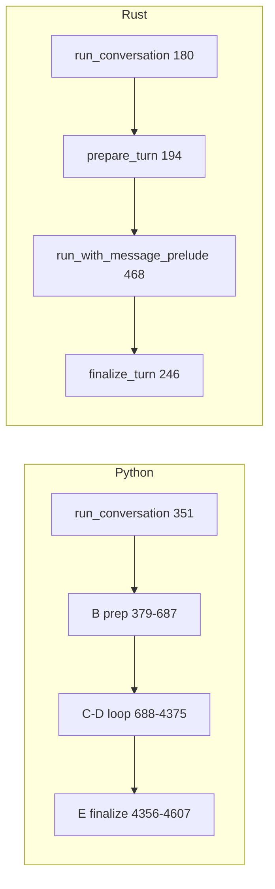

# `run_conversation` Parity: Python ↔ Rust

**Goal:** 100% behavioral parity between Python `agent.conversation_loop.run_conversation` and Rust `hermes-agent` conversation turn API.

**Last refreshed:** 2026-05-19 (after unified `run_with_message_prelude`, `_use_streaming` gates, B/C–D/E split).

## Architecture mapping

Python keeps almost everything inside one function (`run_conversation`, ~3.9k lines). Rust splits the same responsibilities:

| Segment | Python | Rust |
|---------|--------|------|
| **Product entry** | `conversation_loop.py:351` `run_conversation` | `conversation_loop.rs:180` `AgentLoop::run_conversation` |
| **Thin forwarder** | `run_agent.py:4333` `AIAgent.run_conversation` | CLI/gateway construct `AgentLoop` + call `run_conversation` directly |
| **B — turn prep** | inline `351–687` | `conversation_loop.rs:194` `prepare_turn` + `agent_loop.rs:6377` `apply_turn_message_prelude` |
| **C–D — tool loop** | inline `688–4375` | `conversation_loop.rs:468` `run_with_message_prelude` |
| **E — turn finalize** | inline `4356–4607` | `conversation_loop.rs:246` `finalize_turn` + `agent_loop.rs:2408` `finalize_agent_result` |
| **LLM HTTP + retry** | `agent/chat_completion_helpers.py` | `agent_loop.rs:5512` `call_llm_with_retry` / `6020` `collect_stream_llm_response` |
| **Tool dispatch** | `run_agent.handle_function_call` | `agent_loop.rs:7049` `execute_tool_calls` |

## Entry points & types

| Item | Python | Rust | Status |
|------|--------|------|--------|
| Public API | `run_conversation(agent, …) -> dict` `351` | `run_conversation(params) -> ConversationResult` `180` | ✅ |
| Params | kwargs at `351–358` | `RunConversationParams` `58–68` | ✅ (no separate `system_message`; use config / stored prompt) |
| Loop result type | fields in dict `4507–4535` | `AgentResult` + `ConversationResult` `75–118` | ⚠️ see return table |
| `run` / `run_stream` | N/A (in-loop `_use_streaming`) | `414` / `436` → `run_with_message_prelude` `468` | ✅ (Rust exposes engine wrappers) |
| History helper | caller strips user line | `split_messages_for_run_conversation` `141` | ✅ |
| `final_response` extract | loop `4498–4504` | `extract_last_assistant_reply` `151` | ✅ |
| `last_reasoning` extract | loop `4498–4504` | `extract_last_reasoning_current_turn` `162` | ✅ |

## B segment — turn preparation

| Behavior | Python `conversation_loop.py` | Rust | Status |
|----------|-------------------------------|------|--------|
| Safe stdio install | `381` `_install_safe_stdio` | — (OS/CLI layer) | ⚠️ out of crate |
| Ensure DB session | `383` `_ensure_db_session` | session via `session_persistence` on persist | ⚠️ partial |
| `set_runtime_main` (auxiliary) | `390–397` | — | ❌ |
| Session log context | `401` `set_session_context` | `tracing` + config `session_id` | ⚠️ partial |
| Skill write-origin ContextVar | `409` `set_current_write_origin` | — | ❌ |
| Restore primary runtime | `414` `_restore_primary_runtime` | `apply_turn_message_prelude` → `restore_primary_runtime_at_turn_start` `agent_loop.rs:6386` | ✅ |
| Sanitize user / persist override | `419–422` | `prepare_turn` `198–204` | ✅ |
| Bind `stream_callback` | `425` `agent._stream_callback` | `run_with_message_prelude` `on_chunk` arg | ✅ |
| `task_id` + `_current_task_id` | `429–434` | `prepare_turn` `218–225` | ✅ |
| Reset per-turn retry / guard state | `436–450` | reset inside `run_with_message_prelude` locals `649–674` | ✅ |
| `_vision_supported = True` | `455` | vision adapter elsewhere | ⚠️ partial |
| Dead connection cleanup | `457–469` | — | ❌ |
| Replay compression warning | `472–474` | — | ❌ |
| `IterationBudget` new turn | `479` | `conversation_loop.rs:673` | ✅ |
| Turn start log | `481–490` | `tracing` in loop / replay | ⚠️ partial |
| Copy history + append user | `493–562` | `prepare_turn` `230–231` | ✅ |
| Hydrate todo from history | `498–499` | `hydrate_todo_store` `567` (in loop setup) | ✅ |
| Hydrate memory nudge counters | `510–520` | `hydrate_memory_nudge_counters_from_history` `278` | ✅ |
| User turn count++ | `529` | evolution counters in loop | ⚠️ partial |
| Reset stream/think scrubbers | `531–541` | `stream_scrubber` per iteration `690–692` | ✅ |
| `original_user_message` | `544` | `TurnFinalizeMeta` `206–208` | ✅ |
| Memory nudge arm (`_should_review_memory`) | `549–556` | `595–605` | ✅ |
| System prompt cache / restore | `568–582` `_restore_or_build_system_prompt` `218–318` | `active_cached_system_prompt` `374` / `resolve_initial_system_prompt` `394` | ✅ |
| Preflight compression | `584–650` | `preflight_context_compress_with_status` `620–622` | ✅ |
| **`pre_llm_call` hook (once before loop)** | `652–686` | `PreLlmCall` **each** loop iter `862–863` | ⚠️ **timing differs** |
| Plugin context → user message | `663–684` | `inject_hook_context` into ctx (system/user) | ⚠️ partial |

## C–D segment — main loop (`run_with_message_prelude`)

| Behavior | Python `conversation_loop.py` | Rust | Status |
|----------|-------------------------------|------|--------|
| **Codex app-server bypass** | `747–753` early `return _run_codex_app_server_turn` | — | ❌ |
| Interrupt thread setup | `708–722` | `InterruptController` | ✅ |
| Memory `on_turn_start` | `727–732` | `memory_on_turn_start` `779` | ✅ |
| Memory prefetch (once) | `739–745` | `memory_prefetch` + `set_turn_ext_prefetch_cache` `609–618` | ✅ |
| Session `on_session_start` hook | `_restore_or_build_system_prompt` `290–303` | `OnSessionStart` when prompt not restored `552–559` | ✅ |
| ContextLattice / exploratory / objective hints | scattered in loop setup | `568–581` | ✅ |
| Replay recorder | env-gated | `ReplayRecorder` `623–639` | ✅ |
| Max turns / iteration budget | `761` while + budget | `706–748`, `iteration_budget` | ✅ |
| Per-iter: skill iter counter | `818–820` | `766–777` | ✅ |
| Per-iter: checkpoint interval | (in loop body) | `781–785` | ✅ |
| Memory flush interval sync | (in loop) | `791–795` `memory_sync` | ✅ |
| Smart route + reliability guard | (in loop) | `798–835` | ✅ |
| Turn governor / replay `turn_start` | (in loop) | `806–860` | ✅ |
| **`pre_llm_call` per iteration** | once before loop only | `862–863` each iter | ⚠️ see above |
| **`/steer` pre-API drain** | `822–857` | `pending_steer.drain_pre_api_into_messages` in `call_llm_with_retry` `agent_loop.rs:2845` | ✅ |
| **`_use_streaming` decision** | `1244–1273` | `use_streaming_llm_transport` `agent_loop.rs:6525` + `ui_streaming` `476` | ✅ |
| Streaming API call | `_interruptible_streaming_api_call` | `collect_stream_llm_response` `890` | ✅ |
| Non-stream API call | `_interruptible_api_call` | `call_llm_with_retry` (else branch) | ✅ |
| Stream-not-supported → disable session stream | `chat_completion_helpers` ~2250 | `note_stream_not_supported` `agent_loop.rs:6552` | ✅ |
| Copilot-ACP / acp URL → non-stream | `1254–1259` | `provider_blocks_llm_streaming` `6513` | ✅ |
| No consumers + Mock → non-stream | `1260–1266` | `prefers_non_streaming_transport` on `LlmProvider` | ✅ |
| Empty / thinking inner retry | (in response handling) | inner loop `871–968` | ✅ |
| Post-LLM hooks / transforms | (in loop) | `inject_hook_context` + `apply_transform_llm_output_hooks` | ⚠️ partial |
| Ollama small context guard | `1053–1068` | — | ❌ |
| Nous rate-limit guard | `1123–1149` | — | ❌ |
| API retry matrix (auth, 429, compression, vision, …) | `1122–~3200` | `call_llm_with_retry_inner` `5535` | ⚠️ large surface — audit per classifier |
| Cost guard degrade route | (in loop) | `resolve_cost_degrade_model` / `turn_route_cost_guard` | ✅ |
| Tool call dedupe / repair / session_search hydrate | (in loop) | `deduplicate_tool_calls` / `repair_tool_call` / `hydrate_session_search_args` | ✅ |
| Parallel tool execution | `handle_function_call` | `execute_tool_calls` `7049` | ✅ |
| Tool guardrail halt | `3800–3805` | `tool_guardrails` + exit `guardrail_halt` | ⚠️ partial metadata |
| Tool loop guard summary | (governor) | `handle_tool_loop_guard_summary` | ✅ |
| Stream mute / `stream_break` control chunks | `3750+` | `stream_mute` / `emit_stream_chunk` `475–523` | ✅ |
| Objective / finalizer retry guards | (in loop) | `objective_guard_*` / `finalizer_*` | ✅ |
| Continuation / truncated tool / codex ack | (in loop) | `continuation_retries`, `truncated_tool_call_retries`, `codex_ack_continuations` | ⚠️ audit |
| Budget pressure injection | (in loop) | `inject_budget_pressure_into_last_tool_result` | ✅ |
| Context pressure warn | (in loop) | `should_emit_context_pressure_warning` | ✅ |
| Auto-compress in loop | (in loop) | `auto_compress_if_over_threshold` `2069` | ✅ |
| Background review metrics emit | (in loop) | `emit_background_review_metrics` `2040` | ✅ |
| Max-iter summary + kanban failure | `4300–4354` | `handle_max_iterations` (no kanban path) | ⚠️ partial |

## E segment — finalize & return

| Behavior | Python `conversation_loop.py` | Rust | Status |
|----------|-------------------------------|------|--------|
| `completed` semantics | `4357–4361` | `finalize_turn` `255` | ✅ |
| Trajectory save | `4363–4365` | — | ❌ |
| Task VM/browser cleanup | `4367–4368` | — | ❌ |
| Drop empty scaffolding | `4374` | — | ❌ |
| Persist session (JSON + SQLite) | `4375` `_persist_session` | `persist_turn_session` if `persist_session` `263–265` | ⚠️ opt-in flag |
| Turn-exit diagnostic log | `4377–4419` | `tracing` + `turn_exit_reason` in `AgentResult` | ⚠️ partial |
| `post_llm_call` hook on final text | `4475–4487` | `apply_turn_level_output_hooks` `257–260` | ✅ |
| `last_reasoning` boundary | `4498–4504` | `extract_last_reasoning_current_turn` `253` | ✅ |
| **`on_session_end` plugin (per turn)** | `4591–4605` every call | `turn_end_plugin_hooks` (plugin only; **not** memory shutdown) `agent_loop.rs:3721` | ✅ per Python comment `4584–4589` |
| Memory `on_session_end` at turn end | intentionally **not** called | same | ✅ |
| `memory_sync` after turn | `4565–4570` | in-loop + end paths | ⚠️ partial |
| Background memory/skill review | `4572–4582` | `spawn_background_review` `1416` | ✅ |
| Skill nudge after loop | `4556–4562` | skill counter in loop; review at end | ✅ |
| `pending_steer` leftover | `4541–4543` | `finalize_agent_result` drains `pending_steer` `2430` | ✅ |
| Clear interrupt + stream callback | `4550–4554` | interrupt in `AgentLoop`; no global callback leak | ✅ |

## Return dict / `ConversationResult` fields

| Python key `4507–4535` | Rust | Status |
|------------------------|------|--------|
| `final_response` | `ConversationResult.final_response` | ✅ |
| `last_reasoning` | `ConversationResult.last_reasoning` | ✅ |
| `messages` | `loop_result.messages` / accessor `87` | ✅ |
| `api_calls` | `loop_result.api_calls` | ✅ |
| `completed` | `ConversationResult.completed` | ✅ |
| `turn_exit_reason` | `loop_result.turn_exit_reason` | ✅ |
| `failed` | `loop_result.failed` | ✅ |
| `partial` | `loop_result.partial` | ✅ |
| `interrupted` | `loop_result.interrupted` | ✅ |
| `pending_steer` | `loop_result.pending_steer` | ✅ |
| `model` / `provider` / `base_url` | active runtime via config (not top-level on `ConversationResult`) | ⚠️ |
| Token breakdown fields | `loop_result.usage` partial | ⚠️ |
| `estimated_cost_usd` / `cost_status` / `cost_source` | `session_cost_usd` on `AgentResult` | ⚠️ partial |
| `guardrail` metadata | — | ❌ |
| `response_transformed` / `response_previewed` | — | ❌ |
| `interrupt_message` | — | ❌ |
| `session_id` | config | ⚠️ |

## Related Python modules (not in `conversation_loop.rs`)

| Python module | Role | Rust home | Status |
|---------------|------|-----------|--------|
| `agent/chat_completion_helpers.py` | interruptible API, streaming collect, retry/fallback | `agent_loop.rs` `5512+` / `6020+` | ⚠️ ongoing parity |
| `run_agent.handle_function_call` | tool execution | `agent_loop.rs` `7049` | ⚠️ ongoing |
| `agent/iteration_budget.py` | turn budget | `iteration_budget.rs` | ✅ |
| `agent/message_sanitization.py` | sanitize, continuation, budget strip | `message_sanitization.rs` | ⚠️ ongoing |
| `agent/tool_guardrails.py` | halt decisions | `tool_guardrails.rs` | ⚠️ partial |
| `agent/nous_rate_guard.py` | Nous RPH guard | `nous_rate_guard.rs` | ⚠️ guard + record; full 429 matrix ongoing |
| `agent/transports/codex_app_server_session.py` | codex app-server turn | `codex_runtime.rs` (gate + stub turn) | ⚠️ subprocess client pending |
| `hermes_cli/plugins.py` | hooks | `plugins.rs` | ⚠️ ongoing |

## Tests (parity contracts)

| Area | Rust test location |
|------|-------------------|
| `run_conversation` task_id / steer | `tests/run_conversation_contracts.rs` |
| Stream callback | `phase_a11_run_conversation_stream_callback_receives_deltas` |
| `run` / interrupt / budget | `tests/run_agent_phase_a.rs` |
| Hooks / pre-api | `tests/run_conversation_hooks.rs` |
| `_use_streaming` gates | `agent_loop::tests::test_use_streaming_llm_transport_matches_python_gates` |
| Message sanitization | `message_sanitization` / `alignment_contracts` fixtures |

## Priority gaps for 100% parity

1. **`codex_app_server` subprocess client** — gate + `run_codex_app_server_turn` stub (`rs:codex_runtime.rs`); port `CodexAppServerSession`.
2. **`pre_llm_call` hook payload** — once-before-loop + user-message inject (`rs:~620`); verify plugin parity fixtures.
3. **Nous rate guard 429 recording** — pre-call guard (`rs:nous_rate_guard.rs`); wire `is_genuine_nous_rate_limit` on errors.
4. **Ollama context guard** — `ollama_context_limit_error` (`rs:message_sanitization.rs` ~177).
5. **Return dict telemetry** — `AgentResult` fields + accessors (`rs:types.rs`, `ConversationResult`).
6. **Turn-end persist** — Python always `_persist_session`; Rust requires `persist_session: true`.
7. **Infrastructure hooks** — `set_runtime_main`, dead-connection cleanup, trajectory, kanban budget path.
8. **`chat_completion_helpers` / retry matrix** — line-by-line audit against `call_llm_with_retry_inner` (largest remaining surface).

## Line index quick reference

| Symbol | Python file:line | Rust file:line |
|--------|------------------|----------------|
| `run_conversation` | `conversation_loop.py:351` | `conversation_loop.rs:180` |
| `prepare_turn` (B) | (inline 379–687) | `conversation_loop.rs:194` |
| `run_with_message_prelude` (C–D) | (inline 688–4375) | `conversation_loop.rs:468` |
| `finalize_turn` (E) | (inline 4356–4607) | `conversation_loop.rs:246` |
| `_use_streaming` | `conversation_loop.py:1244–1273` | `agent_loop.rs:6525` `use_streaming_llm_transport` |
| `_restore_or_build_system_prompt` | `conversation_loop.py:218` | `conversation_loop.rs:374–405` |
| `AIAgent.run_conversation` forwarder | `run_agent.py:4333` | — |
