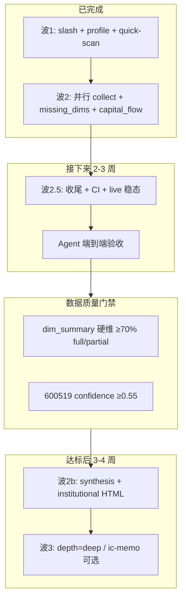

# Hermes Equity Research · 下一步完整计划

> **现状（2026-06-25）**：波 2 数据管道已合并（`65e0343e36`）。离线 parity + fetcher 单测全绿；Agent 端到端与 CI 全仓仍有缺口。  
> **终态目标**：A 股 `symbol → collect → 模型 → 评分 → 66 人格 → JSON（+ 可选精简 HTML）`，`data_confidence` / `missing_dims` 可信；**不追** UZI 600KB / Python / Playwright。  
> **对照**：[`EQUITY_RESEARCH_CHECKLIST.md`](../../EQUITY_RESEARCH_CHECKLIST.md)、[`EQUITY_RESEARCH_TODO.md`](../../EQUITY_RESEARCH_TODO.md)、[`docs/sop/equity_research_data.md`](../sop/equity_research_data.md)

---

## 总览路线图



---

## 阶段 0 · 立即收尾（1–2 天）

**目标**：清掉测试 session 遗留项，CI 不被无关失败绊倒。

| # | 任务 | 交付 | 验收 |
|---|------|------|------|
| 0.1 | 提交测试修复 | `agent_loop/tests.rs` import 修复 + `fixtures/code_execution_stubs/web_search_only.expected.txt` | `cargo test -p hermes-tools --lib code_execution_stubs` 绿 |
| 0.2 | 修 push2 live 解析 | `eastmoney_http.rs`：大数字字段 `i64` → `f64` 或 `serde_json::Value` 容错 | `cargo test -p hermes-trading live_push2_quote_600519 -- --ignored` 绿 |
| 0.3 | Push + CI | `feat/6.12_cyt` 推远程，看 parity job | `equity_research` + `quick_scan_profile` 在 CI 绿 |

**不做**：`upstream_core_tool_contracts.rs` 大改 — 单独 PR，不挡 equity research。

---

## 阶段 1 · Agent 端到端验收（2–3 天）

**目标**：证明波 2 在真实对话里可用，而不只是单测。

### 1.1 三条路径手测

| 命令 | 检查项 |
|------|--------|
| `/quick-scan 688126` | `depth=lite`；无 `web_search`；markdown 含速判；JSON 无 66 评委表 |
| `/analyze-stock 600519` | `dim_summary` 非空；`missing_dims` 含 web 维（如 `3_macro`）；`summary_markdown` 完整 |
| `/equity-research 沪硅产业` | 同 medium；`resolve_a_share_symbol` → `688126.SH` |

### 1.2 JSON 验收模板（600519 medium）

复制 `analyze_stock` 返回 JSON，对照：

- [ ] `dim_summary.length ≥ 12`（medium 硬维大部分有记录）
- [ ] `missing_dims` 是维名（如 `"3_macro"`），不是静默中性分
- [ ] `12_capital_flow.data` 含 main_fund / northbound / holder 中至少 2 项
- [ ] `10_valuation`：有 pe 但无分位时 → `missing` 含 `pe_percentile`
- [ ] `data_confidence.score ≥ 0.55`（茅台基准）
- [ ] `used_fallback` 非空时 narrative 有提及

### 1.3 Gate 行为

1. 先 `get_quote 600519.SH`，再 `web_search` → **应被 block**
2. `analyze_stock` 完成后 `web_search` → **应放行**
3. `/quick-scan` 路径 → web **不 block**

### 1.4 可选：录 live golden

对 `688126` / `600519` 跑 medium，把 `dim_summary` + 关键 `raw_dims` 字段脱敏后写入 `fixtures/trading_research_fetch/live_smoke/`（**不进 CI**，仅本地回归参考）。

---

## 阶段 2 · 波 2.5 数据管道收尾（1–2 周）

**目标**：完成 Checklist B/H/F 剩余项；整体完成度 **~85% → ~92%**。

### 轨 B · 剩余硬数据维（单维单 PR）

按 [`docs/sop/equity_research_data.md`](../sop/equity_research_data.md) 门禁，每维：**fetcher → bridge → scoring grep → golden**。

| 优先级 | 维 | 要点 | 估时 |
|--------|-----|------|------|
| P1 | `15_events` | 公告/新闻字段与 `18_trap` 消费对齐 | 1–2d |
| P1 | `6_research` | `research_count` + 报告列表稳态 | 1d |
| P1 | `16_lhb` | `lhb_count_30d` / `matched_youzi` 与 scoring 一致 | 1–2d |
| P2 | `18_trap` | 规则加深（可选）；仍交 LLM 定性 | 0.5d |

每 PR 门禁：

```bash
cargo build -p hermes-trading
cargo test -p hermes-trading --lib research::fetchers
cargo test -p hermes-parity-tests equity_research
cargo clippy -p hermes-trading -- -D warnings
```

### 轨 F · 66 人格校准

| 任务 | 验收 |
|------|------|
| Buffett / 成长 / 周期各 1 股 YAML 规则抽样对照 UZI | 3 case 文档化差异 |
| 缺 `pe_quantile_5y` / FCF 时 **不默认通过** | `personas/evaluator.rs` + golden 更新 |
| `panel_buffett_smoke` 扩展 1 个「低置信度」case | parity 绿 |

### 轨 H · CI / 依赖

| 任务 | 验收 |
|------|------|
| CI job 明确跑 `hermes-trading` + `hermes-parity-tests equity_research` | PR 必过 |
| `akshare` pin 在根 `Cargo.toml` + 说明升级策略 | golden 失败即阻断 |
| `collect` 并行 benchmark（600519 medium，串行 vs 并行） | 文档记录 ≥30% wall time 缩短 |

---

## 阶段 3 · 波 2b 报告层（门禁后再开，2–3 周）

### 开波 2b 的前置条件（全部满足）

| 门禁 | 标准 |
|------|------|
| G1 | 600519 medium：`dim_summary` 硬数据维 **≥70%** 为 `full` 或 `partial` |
| G2 | `data_confidence.score ≥ 0.55`（茅台）；688126 ≥ 0.40 |
| G3 | Agent E2E 三条路径验收通过 |
| G4 | `live_push2` + akshare quote 冒烟绿 |

### 波 2b 交付清单

| # | 模块 | 说明 |
|---|------|------|
| 3.1 | `research/synthesis/*.rs` | 结构化 synthesis JSON（非 LLM 硬编码） |
| 3.2 | `report/institutional.rs` + `dim_viz` | 精简 institutional HTML（**不追 600KB**） |
| 3.3 | `analyze_stock` 落盘 | `reports/{symbol}_{date}/full-report-standalone.html`（可选 flag） |
| 3.4 | `format=synthesis` | tool schema + skill 文档 |
| 3.5 | Skill 更新 | medium 默认仍 markdown；「发研报」显式 `format=html` |

### 明确不做（波 2b 也不做）

- `depth=deep`、`/ic-memo`、Bull-Bear 辩论 → **波 3**
- Playwright / Python / 雪球 token

---

## 阶段 4 · 波 3 深度模式（可选，4+ 周）

仅在波 2b HTML 稳定、数据管道长期绿之后：

| 功能 | 说明 |
|------|------|
| `depth=deep` | 全量 fetcher + web 维强制补数流程 |
| `/ic-memo` | 投资委员会备忘录模板 |
| WeCom 关键词 | 「分析一下」→ `/equity-research`（Checklist A 可选项） |

---

## 推荐执行顺序

| 周 | 重点 | 产出 |
|----|------|------|
| **W1** | 阶段 0 + 阶段 1 | push2 修复、fixture 提交、Agent 三条路径验收报告 |
| **W2** | 阶段 2 轨 B（events/research/lhb） | 3 个单维 PR + golden 扩展 |
| **W3** | 阶段 2 轨 F + H | 人格校准、CI 门禁、collect benchmark |
| **W4** | 门禁评审 | 对照 G1–G4，决定开不开波 2b |
| **W5–7** | 阶段 3（若门禁过） | synthesis + institutional HTML |

---

## 每周固定回归命令

```powershell
# 波 2 核心门禁（约 5 分钟）
cargo build -p hermes-trading -p hermes-tools
cargo test -p hermes-trading --lib research::fetchers
cargo test -p hermes-parity-tests equity_research
cargo test -p hermes-parity-tests quick_scan_profile
cargo clippy -p hermes-trading -- -D warnings

# Agent 相关（lib only，避开过期 integration test）
cargo test -p hermes-tools --lib skill_commands
cargo test -p hermes-agent --lib equity_research_gate

# Live 冒烟（可选，要网络）
cargo test -p hermes-trading live_akshare_quote_600519 -- --ignored
cargo test -p hermes-trading live_push2_quote_600519 -- --ignored
```

---

## 决策点

1. **波 2b 何时开？**  
   建议：完成阶段 1 E2E + G1/G2 门禁后再开，避免「有 HTML 壳、数据仍缺」。

2. **WeCom / 关键词触发要不要做？**  
   - Cursor Agent 为主 → 延后到波 3  
   - 企业微信为主 → 提到阶段 2 并行做

3. **live golden 进不进 CI？**  
   建议：**不进**（网络不稳定）；仅本地 `--ignored` 冒烟 + offline golden 进 CI。

---

## 当前完成度（波 2 后）

| 模块 | 完成度 |
|------|--------|
| 22 维取数 | ~75% |
| bridge / 可信度 | ~90% |
| 19 维评分 | ~80% |
| Agent 编排 | ~90% |
| 测试回归 | ~80%（CI 全绿待确认） |
| 报告 HTML | ~70%（精简版已有，institutional 待 2b） |
| **整体 Hermes 终态** | **~85–88%** |

---

## 波 1 / 波 2 已交付（摘要）

| 波次 | 交付 |
|------|------|
| **波 1** | `/quick-scan`、`/analyze-stock`、`AnalysisProfile` lite/medium、quick-scan markdown、slash 命令、gate lite 豁免 |
| **波 2** | collect 拓扑并行、`cached_basic`、`dim_summary` / `missing_dims`、capital_flow 加深、medium 不再 `neutral_dim` 伪装缺数、fetcher golden 扩展 |
