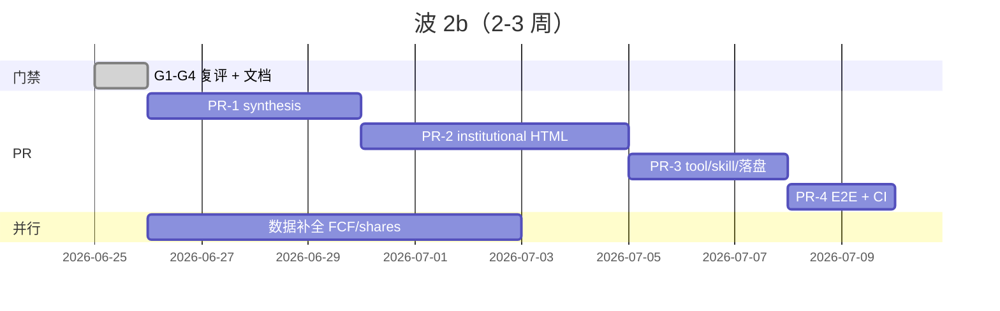

# Equity Research · 波 2b 执行计划

> **分支**：`feat/6.12_cyt`  
> **目标**：在数据门禁达标后，交付 **synthesis JSON + institutional HTML 研报**，不追 UZI 600KB / Python / Playwright。  
> **对照**：[`EQUITY_RESEARCH_NEXT_STEPS_2026-06-25.md`](EQUITY_RESEARCH_NEXT_STEPS_2026-06-25.md)、[`GATE_REVIEW_2026-06-25.md`](../insights/GATE_REVIEW_2026-06-25.md)

---

## 1. 波 2b 是什么

| 已有（波 2） | 波 2b 新增 |
|--------------|------------|
| `analyze_stock` → JSON + `summary_markdown` | **`synthesis` 结构化结论块**（确定性，非 LLM 硬编码） |
| 精简 `render_html_report`（`format=html` 已存在） | **institutional HTML**：版式、dim 可视化、缺失维警示 |
| Agent slash + gate | **可选落盘** + skill 显式「发研报」路径 |
| 66 人格 + DCF + 19 维评分 | HTML 中完整呈现 + synthesis 摘要 |

**不做（留给波 3）**：`depth=deep`、`/ic-memo`、Bull-Bear 辩论、Playwright、雪球 token。

---

## 2. 开波前置：门禁复评（Day 0）

| 门禁 | 标准 | 2026-06-25 状态 | 2b 前动作 |
|------|------|-----------------|-----------|
| **G1** | 600519 硬维 ≥70% full/partial | ✓ ~82% | 维持 `live_gate_600519_medium` |
| **G2** | 600519 ≥0.55；688126 ≥0.40 | ✓ live **0.574**（EM datacenter 补财务后） | 更新 `GATE_REVIEW` 结论；并行补 FCF/shares/pe_quantile |
| **G3** | slash + `equity_research_gate` | ✓ 7/7 | 2b 阶段加 HTML E2E 用例 |
| **G4** | quote 冒烟 | △ push2 直连 TLS ✗；akshare+腾讯 ✓ | **接受 operational pass** 并写进 roadmap |

**开波决策**：G1/G2/G3 已满足 2b 启动条件；G4 以「akshare 主路 + 腾讯 fallback 绿」为准，不阻塞 HTML。

```powershell
cargo test -p hermes-trading research::gate -- --nocapture
cargo test -p hermes-trading live_gate -- --ignored --nocapture
cargo test -p hermes-agent --lib equity_research_gate
cargo test -p hermes-parity-tests equity_research
```

---

## 3. 现状盘点（避免重复造轮子）

| 模块 | 路径 | 状态 |
|------|------|------|
| 分析编排 | `research/analyze.rs` | ✓ `AnalyzeStockResult` |
| Markdown 报告 | `research/report/markdown.rs` | ✓ medium / lite |
| **精简 HTML** | `research/report/html.rs` | ✓ 表格 + SVG gauge |
| SVG 组件 | `research/report/svg.rs` | ✓ 置信度 / PE 分位 |
| Tool `format=html` | `hermes-tools/.../trading_analyze_stock.rs` | ✓ institutional 默认 |
| **synthesis** | `research/synthesis/` | ✓ PR-1 `c30e520` |
| **institutional HTML** | `research/report/institutional.rs` | ✓ PR-2 |
| **dim_viz** | `research/report/dim_viz.rs` | ✓ PR-2 |
| 落盘 | `research/report/disk.rs` | ✓ PR-3 `write_report` |
| `format=synthesis` | tool schema | ✓ PR-3 |

---

## 4. 执行阶段（建议 2–3 周，4 个 PR）

### PR-1 · synthesis 结构化结论（~4 天）

**目标**：从 `AnalyzeStockResult` 确定性生成 `SynthesisReport` JSON，供 HTML / Agent 复用。

| 任务 | 说明 |
|------|------|
| 4.1.1 | 新建 `crates/hermes-trading/src/research/synthesis/mod.rs` |
| 4.1.2 | `SynthesisReport` 字段：`headline`, `verdict`, `confidence_tier`, `key_metrics[]`, `risks[]`, `missing_highlights[]`, `panel_summary`, `dcf_one_liner` |
| 4.1.3 | `build_synthesis(result: &AnalyzeStockResult) -> SynthesisReport` — 规则来自 scores/dcf/personas/data_confidence，**禁止** LLM 字符串 |
| 4.1.4 | 挂到 `analyze_stock` 输出：`synthesis: Value`（或嵌在 result 序列化） |
| 4.1.5 | Golden：`fixtures/trading_research_fetch/synthesis_moutai_smoke.json` + parity op `build_synthesis` |

**验收**：
- `cargo test -p hermes-trading synthesis`
- `cargo test -p hermes-parity-tests equity_research`
- 600519 golden：verdict / confidence_tier 与 offline fixture 一致

---

### PR-2 · institutional HTML + dim_viz（~5 天）

**目标**：升级 HTML 为「可读研报」版式，复用 synthesis + 现有 scores/personas。

| 任务 | 说明 |
|------|------|
| 4.2.1 | `research/report/institutional.rs`：`render_institutional_html(result, synthesis, narrative?)` |
| 4.2.2 | `research/report/dim_viz.rs`：19 维迷你条 / 缺失维 badge（纯 SVG 或 inline CSS，无 JS） |
| 4.2.3 | 区块：封面摘要 → 关键指标 → DCF 卡片 → 19 维 → 66 评委 → `missing_dims` 警示 → narrative |
| 4.2.4 | `html.rs` 保留为 **legacy/minimal**；institutional 为默认 `format=html` 实现 |
| 4.2.5 | 单测：offline fixture JSON → HTML snapshot（关键 substring，非整页 golden） |

**约束**：
- 单文件 HTML **≤ 150KB**（roadmap 不追 600KB）
- `data_confidence < 0.55` 时页眉 **warn banner**
- `missing_dims` 非空时列出维名（与 medium markdown 一致）

**验收**：
- `cargo test -p hermes-trading institutional`
- 本地：`analyze_stock(..., format=html)` 600519 → 浏览器打开无乱码、含 synthesis headline

---

### PR-3 · Tool / Skill / 可选落盘（~3 天）

**目标**：Agent 路径清晰；用户说「发研报」时走 HTML + synthesis。

| 任务 | 说明 |
|------|------|
| 4.3.1 | `analyze_stock` schema 增加 `format: "synthesis"` → 返回 JSON 仅含 synthesis + 核心指标 |
| 4.3.2 | `format=html` 默认走 `render_institutional_html`；`narrative` 参数保留 |
| 4.3.3 | 可选 flag `write_report: true` → 落盘 `{HERMES_HOME}/reports/{symbol}_{date}/full-report-standalone.html` + `analysis.json` |
| 4.3.4 | 更新 `skills/finance/equity-research/SKILL.md`：medium 默认 markdown；「研报/HTML/发报告」→ `format=html` |
| 4.3.5 | `equity_research_gate`：lite 仍禁止 html（已有）；medium 允许 html |

**验收**：
- `cargo test -p hermes-tools --lib skill_commands`
- `cargo test -p hermes-agent --lib equity_research_gate`
- Skill 文档与 tool enum 一致

---

### PR-4 · E2E + 文档 + CI（~2 天） ✅

| 任务 | 说明 |
|------|------|
| 4.4.1 | 更新 `GATE_REVIEW` / `E2E_REPORT`：2b 已交付 | ✅ |
| 4.4.2 | CI `equity_research_gate` step 增加 synthesis/report/agent 测试 | ✅ |
| 4.4.3 | 手测清单：600519 `format=html` + 688126 `format=synthesis` + `/quick-scan` lite-only | ✅ 文档化 |
| 4.4.4 | ignored live：`live_html_600519_smoke` | ✅ |

---

## 5. 并行轨：数据补全（不挡 2b 壳，挡 narrative 质量）

与 2b **并行**、单独小 PR：

| 字段 | 用途 | 建议 |
|------|------|------|
| `fcf_latest_yi` | DCF / Buffett 规则 | EM cashflow datacenter 或 akshare THS |
| `shares_outstanding_yi` | 置信度 + DCF 每股 | push2 `total_shares` / individual_info（已部分修） |
| `pe_quantile_5y` | 估值维 + SVG | valuation Baidu 系列容错 |
| `equity_yi` / `cash_yi` | 健康度 narrative | EM datacenter 列名对齐 |

目标：live G2 **≥ 0.65**，减少 HTML warn banner 频率。

---

## 6. 里程碑与时间线



| 里程碑 | 完成标志 |
|--------|----------|
| **M1** | synthesis golden parity 绿 |
| **M2** | institutional HTML 600519 本地验收 |
| **M3** | skill「发研报」路径 + optional 落盘 |
| **M2b 完成** | G3 + synthesis parity + HTML E2E 文档 |

---

## 7. 风险与回滚

| 风险 | 缓解 |
|------|------|
| live financials 偶发 error → G2 抖动 | collect 层 financials 重试；gate 测试串行 financials |
| HTML 体积膨胀 | 硬限 150KB；评委表可折叠为 top-N |
| synthesis 与 markdown 结论不一致 | 同一 `build_synthesis` 源；markdown 可选引用 synthesis headline |
| push2 仍 TLS 失败 | G4 operational pass；不依赖 push2 做 HTML |

**回滚**：`format=html` 切回 `html.rs` minimal；synthesis 字段 optional，旧客户端忽略。

---

## 8. 推荐第一条命令（开工 PR-1）

```powershell
# 1. 确认门禁
cargo test -p hermes-trading live_gate -- --ignored --nocapture

# 2. 建 synthesis 模块骨架
#    crates/hermes-trading/src/research/synthesis/mod.rs
#    + research/mod.rs pub use

# 3. 录 golden
#    fixtures/trading_research_fetch/synthesis_moutai_smoke.json
```

---

## 9. 完成定义（Definition of Done）

- [x] `build_synthesis` parity golden 绿
- [x] `format=html` 输出 institutional 版（非 legacy 表格）
- [x] `format=synthesis` 在 tool schema 与 SKILL 文档中可用
- [x] medium 默认仍为 markdown；lite 禁止 html
- [x] `cargo clippy -p hermes-trading -- -D warnings` 无新增
- [x] GATE_REVIEW 更新为「**2b 已交付**」
