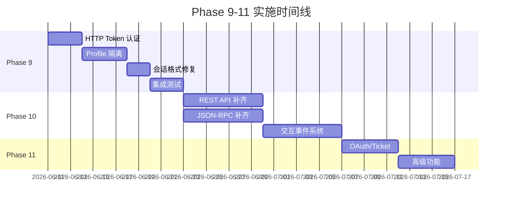

# hermes-server Phase 9-11 详细实施计划

> **最后更新**：2026-06-10
> 
> 本文档详细描述 Phase 9-11 的技术方案、任务分解、验收标准和风险评估。

## 目录

1. [Phase 9：Desktop 兼容性修复](#phase-9)
2. [Phase 10：核心功能补齐](#phase-10)
3. [Phase 11：高级功能](#phase-11)
4. [时间线](#时间线)
5. [技术决策](#技术决策)

---

## Phase 9：Desktop 兼容性修复（2 周）

### 目标

解决 Desktop 应用连接 Rust 后端的阻断性问题，确保 Electron 主进程能正常通信。

### 背景

根据对 `apps/desktop/electron/main.cjs` 的代码审查，Desktop 应用对后端有以下核心依赖：

1. **HTTP Token 认证**：所有 `/api/*` 请求携带 `X-Hermes-Session-Token` 头
2. **Profile 隔离**：多 profile 会话管理，跨 profile 会话聚合
3. **会话列表格式**：期望数组格式 `[]`，而非对象格式 `{sessions: []}`
4. **WebSocket 认证**：`?token=` query param 或 `?ticket=`（OAuth 模式）

### 技术方案

#### 9.1 HTTP Token 认证中间件

**需求**：
- 验证 `X-Hermes-Session-Token` header
- 支持 `Authorization: Bearer <token>` 回退
- 公共端点白名单（`/api/status`, `/health`, `/api/auth/*`）

**实现**：

```rust
// crates/hermes-server/src/middleware.rs

use axum::{
    body::Body,
    extract::Request,
    middleware::Next,
    response::Response,
};
use http::StatusCode;

/// 公共端点白名单
const PUBLIC_PATHS: &[&str] = &[
    "/api/status",
    "/health",
    "/api/auth/providers",
    "/api/auth/ws-ticket",
    "/login",
    "/auth/callback",
];

/// 认证中间件
pub async fn request_guard(
    State(state): State<AppState>,
    req: Request<Body>,
    next: Next,
) -> Result<Response, StatusCode> {
    let path = req.uri().path();
    
    // 公共端点直接放行
    if PUBLIC_PATHS.iter().any(|p| path.starts_with(p)) {
        return Ok(next.run(req).await);
    }
    
    // 提取 token
    let token = req.headers()
        .get("X-Hermes-Session-Token")
        .and_then(|v| v.to_str().ok())
        .or_else(|| extract_bearer_token(req.headers()));
    
    match token {
        Some(t) if constant_time_eq(t, &state.session_token) => {
            Ok(next.run(req).await)
        }
        _ => {
            let response = Response::builder()
                .status(StatusCode::UNAUTHORIZED)
                .body(Body::from("Unauthorized"))
                .unwrap();
            Ok(response)
        }
    }
}

fn extract_bearer_token(headers: &http::HeaderMap) -> Option<&str> {
    headers.get("Authorization")
        .and_then(|v| v.to_str().ok())
        .and_then(|v| v.strip_prefix("Bearer "))
}

/// 常量时间字符串比较（防时序攻击）
fn constant_time_eq(a: &str, b: &str) -> bool {
    use std::time::Instant;
    
    if a.len() != b.len() {
        return false;
    }
    
    let start = Instant::now();
    let result = a.bytes().zip(b.bytes()).all(|(x, y)| x == y);
    
    // 添加小延迟防止时序攻击
    let elapsed = start.elapsed();
    if elapsed.as_nanos() < 1000 {
        std::thread::sleep(std::time::Duration::from_nanos(1000 - elapsed.as_nanos() as u64));
    }
    
    result
}
```

**验收标准**：
- [ ] Desktop 所有 HTTP 请求携带 `X-Hermes-Session-Token` 能通过认证
- [ ] 无 token 的请求返回 401
- [ ] 公共端点（`/api/status`）无需认证即可访问

---

#### 9.2 Profile 隔离

**需求**：
- AppState 支持 `active_profile` 字段
- Profile 目录：`HERMES_HOME/profiles/<name>/`
- Session DB 按 profile 路径实例化
- 跨 profile 会话聚合

**实现**：

```rust
// crates/hermes-server/src/state.rs

pub struct AppState {
    /// 当前激活的 profile 名称
    pub active_profile: Arc<RwLock<String>>,
    
    /// 基础 HERMES_HOME 路径
    pub hermes_home: PathBuf,
    
    /// 会话 token
    pub session_token: String,
    
    /// 活跃会话（按 session_id 索引）
    pub sessions: Arc<RwLock<HashMap<String, SessionState>>>,
    
    /// 运行时配置
    pub config: Arc<RwLock<GatewayConfig>>,
}

impl AppState {
    /// 获取指定 profile 的 home 目录
    pub fn profile_home(&self, profile: Option<&str>) -> PathBuf {
        let profile = profile.unwrap_or_else(|| {
            self.active_profile.blocking_read().as_str()
        });
        
        if profile == "default" || profile.is_empty() {
            self.hermes_home.clone()
        } else {
            self.hermes_home.join("profiles").join(profile)
        }
    }
    
    /// 获取指定 profile 的 SessionPersistence
    pub fn profile_persistence(
        &self, 
        profile: Option<&str>
    ) -> Result<SessionPersistence, AgentError> {
        let home = self.profile_home(profile);
        std::fs::create_dir_all(&home)
            .map_err(|e| AgentError::Io(format!("create profile dir: {}", e)))?;
        Ok(SessionPersistence::new(&home))
    }
    
    /// 跨 profile 聚合会话列表
    pub async fn aggregate_sessions(
        &self,
        limit: usize,
        offset: usize,
        min_messages: i64,
        order_by_last_active: bool,
    ) -> Result<AggregatedSessions, AgentError> {
        let profiles_dir = self.hermes_home.join("profiles");
        let mut targets = vec![("default".to_string(), self.hermes_home.clone())];
        
        // 扫描 profiles 目录
        if let Ok(entries) = std::fs::read_dir(&profiles_dir) {
            for entry in entries.flatten() {
                let name = entry.file_name().to_string_lossy().to_string();
                if name != "default" && entry.path().is_dir() {
                    targets.push((name, entry.path()));
                }
            }
        }
        
        let mut merged = Vec::new();
        let mut total = 0;
        let mut profile_totals = HashMap::new();
        let mut errors = Vec::new();
        let now = std::time::SystemTime::now()
            .duration_since(std::time::UNIX_EPOCH)
            .unwrap_or_default()
            .as_secs() as i64;
        
        for (name, home) in targets {
            let db_path = home.join("state.db");
            if !db_path.exists() {
                continue;
            }
            
            match SessionPersistence::new(&home) {
                Ok(persistence) => {
                    match tokio::task::spawn_blocking(move || {
                        persistence.ensure_db()?;
                        let sessions = persistence.list_sessions_rich(
                            None, &[], 500, 0, min_messages, order_by_last_active
                        )?;
                        let count = persistence.session_count(
                            None, &[], min_messages, false, false, true
                        )?;
                        Ok::<_, AgentError>((sessions, count))
                    }).await {
                        Ok(Ok((sessions, count))) => {
                            total += count;
                            profile_totals.insert(name.clone(), count);
                            for mut s in sessions {
                                s.profile = Some(name.clone());
                                s.is_default_profile = name == "default";
                                s.is_active = s.ended_at.is_none() && 
                                    s.last_active.map(|t| now - t < 300).unwrap_or(false);
                                merged.push(s);
                            }
                        }
                        Ok(Err(e)) => {
                            errors.push(json!({"profile": name, "error": e.to_string()}));
                        }
                        Err(e) => {
                            errors.push(json!({"profile": name, "error": format!("task: {}", e)}));
                        }
                    }
                }
                Err(e) => {
                    errors.push(json!({"profile": name, "error": e.to_string()}));
                }
            }
        }
        
        // 排序和分页
        let sort_key = if order_by_last_active { "last_active" } else { "started_at" };
        merged.sort_by(|a, b| {
            let a_val = a.last_active.or(a.started_at).unwrap_or(0);
            let b_val = b.last_active.or(b.started_at).unwrap_or(0);
            b_val.cmp(&a_val) // 降序
        });
        
        let window = merged.into_iter()
            .skip(offset)
            .take(limit)
            .collect();
        
        Ok(AggregatedSessions {
            sessions: window,
            total,
            profile_totals,
            limit,
            offset,
            errors,
        })
    }
}
```

**验收标准**：
- [ ] `GET /api/profiles/sessions` 返回跨 profile 聚合的会话列表
- [ ] 每个会话包含 `profile`, `is_default_profile`, `is_active` 字段
- [ ] Profile 切换后，新会话创建到正确的 profile 数据库

---

#### 9.3 修复 `/api/sessions` 返回值格式

**问题**：Desktop 期望数组格式 `[]`，当前返回对象格式 `{sessions: [], total: N}`

**解决方案**：

```rust
// crates/hermes-server/src/rest/sessions.rs

/// GET /api/sessions - List sessions
pub async fn list_sessions(
    State(state): State<AppState>,
    Query(query): Query<ListSessionsQuery>,
) -> Result<Json<serde_json::Value>, AppError> {
    let persistence = state.session_persistence()?;
    persistence.ensure_db()?;
    
    let limit = query.limit.unwrap_or(20);
    let offset = query.offset.unwrap_or(0);
    let min_messages = query.min_messages.unwrap_or(0);
    let order_by_last_active = query.order.as_deref() == Some("recent");
    
    let sessions = tokio::task::spawn_blocking(move || {
        persistence.list_sessions_rich(None, &[], limit, offset, min_messages, order_by_last_active)
    })
    .await
    .map_err(|e| AppError::Internal(format!("task error: {}", e)))?
    .map_err(|e| AppError::Internal(format!("db error: {}", e)))?;
    
    let session_json: Vec<serde_json::Value> = sessions
        .into_iter()
        .map(|s| {
            json!({
                "id": s.id,
                "source": s.source,
                "model": s.model,
                "title": s.title,
                "started_at": s.started_at,
                "last_active": s.last_active,
                "ended_at": s.ended_at,
                "message_count": s.message_count,
                "parent_session_id": s.parent_session_id,
                "preview": s.preview,
            })
        })
        .collect();
    
    // 检查是否需要 legacy 格式（对象格式）
    if query.format.as_deref() == Some("legacy") {
        // 返回对象格式（向后兼容）
        Ok(ok_json(json!({
            "sessions": session_json,
            "total": session_json.len(),
            "limit": limit,
            "offset": offset,
        })))
    } else {
        // 返回数组格式（Desktop 期望）
        Ok(ok_json(json!(session_json)))
    }
}
```

**验收标准**：
- [ ] `GET /api/sessions` 默认返回数组格式
- [ ] `GET /api/sessions?format=legacy` 返回对象格式
- [ ] Desktop 能正确解析会话列表

---

#### 9.4 CLI Profile 参数

**实现**：

```rust
// crates/hermes-server/src/main.rs

#[derive(Parser)]
struct Args {
    /// 指定 profile
    #[arg(long, default_value = "default")]
    profile: String,
    
    // ... 其他参数
}

#[tokio::main]
async fn main() -> Result<(), Box<dyn std::error::Error>> {
    let args = Args::parse();
    
    // 加载指定 profile 的配置
    let config = load_config(&args.profile)?;
    let state = AppState::new(config, hermes_home);
    
    // 设置 active profile
    *state.active_profile.write().await = args.profile;
    
    run_server(addr, state).await
}
```

---

### Phase 9 时间线

| 天数 | 任务 | 负责人 |
|------|------|--------|
| 1-2 | HTTP Token 认证中间件 | TBD |
| 3-5 | Profile 隔离实现 | TBD |
| 6-7 | 会话格式修复 + 跨 profile 聚合 | TBD |
| 8-10 | CLI 参数 + 集成测试 | TBD |

---

## Phase 10：核心功能补齐（3 周）

### 10.1 REST API 补齐

#### 10.1.1 会话批量操作

```rust
// POST /api/sessions/bulk-delete
pub async fn bulk_delete_sessions(
    State(state): State<AppState>,
    Json(body): Json<BulkDeleteRequest>,
) -> Result<Json<serde_json::Value>, AppError> {
    if body.ids.len() > 500 {
        return Err(AppError::BadRequest("ids must contain at most 500 entries".into()));
    }
    
    let persistence = state.session_persistence()?;
    let ids = body.ids.clone();
    
    let deleted = tokio::task::spawn_blocking(move || {
        persistence.delete_sessions(&ids)
    })
    .await
    .map_err(|e| AppError::Internal(format!("task error: {}", e)))?
    .map_err(|e| AppError::Internal(format!("db error: {}", e)))?;
    
    Ok(ok_json(json!({"ok": true, "deleted": deleted})))
}

// GET /api/sessions/empty/count
pub async fn count_empty_sessions(
    State(state): State<AppState>,
) -> Result<Json<serde_json::Value>, AppError> {
    let persistence = state.session_persistence()?;
    
    let count = tokio::task::spawn_blocking(move || {
        persistence.count_empty_sessions()
    })
    .await
    .map_err(|e| AppError::Internal(format!("task error: {}", e)))?
    .map_err(|e| AppError::Internal(format!("db error: {}", e)))?;
    
    Ok(ok_json(json!({"count": count})))
}

// DELETE /api/sessions/empty
pub async fn delete_empty_sessions(
    State(state): State<AppState>,
) -> Result<Json<serde_json::Value>, AppError> {
    let persistence = state.session_persistence()?;
    
    let deleted = tokio::task::spawn_blocking(move || {
        persistence.delete_empty_sessions()
    })
    .await
    .map_err(|e| AppError::Internal(format!("task error: {}", e)))?
    .map_err(|e| AppError::Internal(format!("db error: {}", e)))?;
    
    Ok(ok_json(json!({"ok": true, "deleted": deleted})))
}
```

#### 10.1.2 Profile 管理

```rust
// GET /api/profiles
pub async fn list_profiles() -> Result<Json<serde_json::Value>, AppError> {
    let profiles = list_profile_infos()?;
    Ok(ok_json(json!(profiles)))
}

// POST /api/profiles
pub async fn create_profile(
    Json(body): Json<CreateProfileRequest>,
) -> Result<Json<serde_json::Value>, AppError> {
    validate_profile_name(&body.name)?;
    create_profile_dir(&body.name)?;
    Ok(ok_json(json!({"ok": true, "name": body.name})))
}

// GET /api/profiles/active
pub async fn get_active_profile(
    State(state): State<AppState>,
) -> Result<Json<serde_json::Value>, AppError> {
    let profile = state.active_profile.read().await.clone();
    Ok(ok_json(json!({"profile": profile})))
}

// POST /api/profiles/active
pub async fn set_active_profile(
    State(state): State<AppState>,
    Json(body): Json<SetProfileRequest>,
) -> Result<Json<serde_json::Value>, AppError> {
    validate_profile_name(&body.profile)?;
    
    // 更新 active profile
    *state.active_profile.write().await = body.profile.clone();
    
    // 清除所有 session 的 AgentLoop 缓存
    state.invalidate_agent_caches().await;
    
    Ok(ok_json(json!({"ok": true, "profile": body.profile})))
}
```

---

### 10.2 JSON-RPC 方法补齐

#### 10.2.1 配置管理

```rust
// rpc/config_rpc.rs

pub async fn handle_config_get(
    request: JsonRpcRequest,
    state: &AppState,
) -> Option<JsonRpcResponse> {
    let config = state.config.read().await;
    let key = request.params.as_ref()?.get("key")?.as_str()?;
    
    let value = match key {
        "model" => json!(config.model),
        "personality" => json!(config.personality),
        "max_turns" => json!(config.max_turns),
        // ... 更多字段
        _ => return Some(JsonRpcResponse::err(
            request.id,
            JsonRpcError::server_error(4002, "unknown config key".into()),
        )),
    };
    
    Some(JsonRpcResponse::ok(request.id, value))
}

pub async fn handle_config_set(
    request: JsonRpcRequest,
    state: &AppState,
) -> Option<JsonRpcResponse> {
    let params = request.params.as_ref()?.as_object()?;
    let key = params.get("key")?.as_str()?;
    let value = params.get("value")?;
    
    {
        let mut config = state.config.write().await;
        match key {
            "model" => config.model = Some(value.as_str()?.to_string()),
            "max_turns" => config.max_turns = value.as_u64()? as u32,
            // ... 更多字段
            _ => return Some(JsonRpcResponse::err(
                request.id,
                JsonRpcError::server_error(4002, "unknown config key".into()),
            )),
        }
    }
    
    // 保存到文件
    let config_path = state.config_path();
    let config = state.config.read().await.clone();
    if let Err(e) = hermes_config::save_config_yaml(&config_path, &config) {
        return Some(JsonRpcResponse::err(
            request.id,
            JsonRpcError::internal_error(format!("config write error: {}", e)),
        ));
    }
    
    // 清除 AgentLoop 缓存
    state.invalidate_agent_caches().await;
    
    Some(JsonRpcResponse::ok(request.id, json!({"ok": true})))
}
```

#### 10.2.2 交互响应方法

```rust
// rpc/interaction.rs

use std::collections::HashMap;
use tokio::sync::{RwLock, oneshot};

/// 全局等待表
pub type PendingInteractions = Arc<RwLock<HashMap<String, oneshot::Sender<String>>>>;

/// approval.respond
pub async fn handle_approval_respond(
    request: JsonRpcRequest,
    pending: &PendingInteractions,
) -> Option<JsonRpcResponse> {
    let params = request.params.as_ref()?.as_object()?;
    let request_id = params.get("request_id")?.as_str()?;
    let choice = params.get("choice")?.as_str()?;
    
    let sender = {
        let mut guard = pending.write().await;
        guard.remove(request_id)
    };
    
    match sender {
        Some(tx) => {
            let _ = tx.send(choice.to_string());
            Some(JsonRpcResponse::ok(request.id, json!({"ok": true})))
        }
        None => Some(JsonRpcResponse::err(
            request.id,
            JsonRpcError::server_error(4007, "request not found or already handled".into()),
        )),
    }
}

// clarify.respond, sudo.respond, secret.respond 实现类似
```

#### 10.2.3 事件推送

```rust
// ws/event_adapter.rs

/// 发送 approval.request 事件并等待响应
pub async fn request_approval(
    session_id: &str,
    tool_name: &str,
    tool_args: &serde_json::Value,
    transport: &ReplaceableTransport,
    pending: &PendingInteractions,
) -> Result<String, AgentError> {
    let request_id = uuid::Uuid::new_v4().to_string();
    let (tx, rx) = tokio::sync::oneshot::channel();
    
    // 注册等待
    pending.write().await.insert(request_id.clone(), tx);
    
    // 发送事件
    let event = JsonRpcEvent::new(
        "approval.request",
        Some(session_id.to_string()),
        Some(json!({
            "request_id": request_id,
            "tool_name": tool_name,
            "tool_args": tool_args,
        })),
    );
    
    transport.write(&serde_json::to_value(event).unwrap_or_default());
    
    // 等待响应（60s 超时）
    match tokio::time::timeout(Duration::from_secs(60), rx).await {
        Ok(Ok(choice)) => Ok(choice),
        Ok(Err(_)) => Err(AgentError::Internal("approval channel closed".into())),
        Err(_) => {
            pending.write().await.remove(&request_id);
            Err(AgentError::Internal("approval timeout".into()))
        }
    }
}
```

---

### 10.3 测试计划

```rust
// tests/interaction_test.rs

#[tokio::test]
async fn test_approval_flow() {
    let state = test_state();
    let pending = PendingInteractions::default();
    
    // 模拟发送 approval.request
    let (response_tx, response_rx) = tokio::sync::oneshot::channel();
    {
        let mut guard = pending.write().await;
        guard.insert("req-1".to_string(), response_tx);
    }
    
    // 模拟客户端响应 approval.respond
    let result = handle_approval_respond(
        JsonRpcRequest {
            jsonrpc: Some("2.0".to_string()),
            method: "approval.respond".to_string(),
            params: Some(json!({"request_id": "req-1", "choice": "allow"})),
            id: Some(json!("test-1")),
        },
        &pending,
    ).await;
    
    assert!(result.is_some());
    assert_eq!(result.unwrap().result.unwrap()["ok"], true);
    
    // 验证 oneshot 收到响应
    let choice = tokio::time::timeout(Duration::from_secs(1), response_rx)
        .await
        .unwrap()
        .unwrap();
    assert_eq!(choice, "allow");
}
```

---

## Phase 11：高级功能（2 周）

### 11.1 OAuth 认证流程

```rust
// rest/auth.rs

/// GET /login - OAuth 登录入口
pub async fn oauth_login(State(state): State<AppState>) -> Result<Response, AppError> {
    // 重定向到 OAuth 提供商授权页面
    let auth_url = build_oauth_url(&state)?;
    Ok(Response::builder()
        .status(StatusCode::FOUND)
        .header("Location", auth_url)
        .body(Body::empty())
        .unwrap())
}

/// GET /auth/callback - OAuth 回调
pub async fn oauth_callback(
    State(state): State<AppState>,
    Query(params): Query<OAuthCallbackParams>,
) -> Result<Json<serde_json::Value>, AppError> {
    // 交换 code 获取 token
    let tokens = exchange_code(&params.code).await?;
    
    // 设置 cookie
    let response = Response::builder()
        .status(StatusCode::OK)
        .header("Set-Cookie", format!("hermes_session_at={}; HttpOnly; Secure; Max-Age=900", tokens.access_token))
        .header("Set-Cookie", format!("hermes_session_rt={}; HttpOnly; Secure; Max-Age=86400", tokens.refresh_token))
        .body(Body::from("Login successful"))
        .unwrap();
    
    Ok(response)
}

/// POST /api/auth/ws-ticket - 生成 WS ticket
pub async fn mint_ws_ticket(
    State(state): State<AppState>,
) -> Result<Json<serde_json::Value>, AppError> {
    let ticket = uuid::Uuid::new_v4().to_string();
    
    // 存储 ticket（30s TTL）
    state.ws_tickets.write().await.insert(
        ticket.clone(),
        tokio::time::Instant::now() + Duration::from_secs(30),
    );
    
    Ok(ok_json(json!({"ticket": ticket})))
}
```

### 11.2 Ticket 验证

```rust
// ws/auth.rs

pub fn authenticate_ws(
    query_params: &[(String, String)],
    state: &AppState,
) -> bool {
    // 检查 ticket
    for (key, value) in query_params {
        if key == "ticket" {
            return verify_ticket(value, state);
        }
    }
    
    // 检查 token（原有逻辑）
    for (key, value) in query_params {
        if key == "token" {
            return hmac_check(value, state.session_token());
        }
    }
    
    // 开发模式允许无认证
    true
}

fn verify_ticket(ticket: &str, state: &AppState) -> bool {
    let tickets = state.ws_tickets.blocking_read();
    match tickets.get(ticket) {
        Some(expiry) if *expiry > tokio::time::Instant::now() => {
            // Ticket 有效，使用后删除（单次使用）
            drop(tickets);
            state.ws_tickets.blocking_write().remove(ticket);
            true
        }
        _ => false,
    }
}
```

---

## 时间线



| Phase | 开始日期 | 结束日期 | 工作日 |
|-------|----------|----------|--------|
| Phase 9 | 2026-06-11 | 2026-06-24 | 12 天 |
| Phase 10 | 2026-06-25 | 2026-07-16 | 15 天 |
| Phase 11 | 2026-07-17 | 2026-07-30 | 10 天 |
| **总计** | | | **37 天（约 7.4 周）** |

---

## 技术决策

### 决策记录 1：Profile 隔离实现方式

**日期**：2026-06-10

**决策**：选项 A（AppState 持有一个 `active_profile` 字符串，所有操作按此 profile 路由）

**理由**：
- 与 Python 实现一致（`profiles_mod.get_profile_dir()`）
- Desktop 期望此行为
- 复杂度可控，无需多进程

**影响**：
- 所有 REST API 需要支持 `?profile=` query param
- Session DB 连接需要按 profile 路径创建

---

### 决策记录 2：交互事件阻塞实现

**日期**：2026-06-10

**决策**：选项 A（`tokio::sync::oneshot` + 全局等待表）

**理由**：
- 与 Python `threading.Event` 语义一致
- 实现简单，易于测试
- 支持超时和清理

**影响**：
- 需要全局 `PendingInteractions` 结构
- 需要处理超时和 session 关闭时的清理

---

### 决策记录 3：认证中间件范围

**日期**：2026-06-10

**决策**：选项 A（所有 `/api/*` 端点都需认证，除白名单）

**理由**：
- 与 Python `auth_middleware` 一致
- 安全性更高，默认拒绝
- 公共端点通过白名单明确标识

**影响**：
- 所有新端点默认需要认证
- 需要维护公共端点白名单

---

### 决策记录 4：会话列表返回值格式

**日期**：2026-06-10

**决策**：默认返回数组，添加 `?format=legacy` 返回对象

**理由**：
- Desktop 期望数组格式
- 对象格式对分页更友好
- 需要向后兼容

**影响**：
- `GET /api/sessions` 默认返回 `[]`
- `GET /api/sessions?format=legacy` 返回 `{sessions: [], total: N}`

---

## 附录 A：Desktop API 依赖清单

根据 `apps/desktop/electron/main.cjs` 代码审查，Desktop 对后端的所有 API 依赖：

### REST API（按优先级）

| 端点 | 方法 | 优先级 | 状态 |
|------|------|--------|------|
| `/api/status` | GET | P0 | ✅ 已实现 |
| `/api/sessions` | GET | P0 | ✅ 已实现（需修复格式） |
| `/api/sessions/:id` | GET/DELETE/PATCH | P0 | ✅ 已实现 |
| `/api/sessions/:id/messages` | GET | P0 | ✅ 已实现 |
| `/api/profiles/sessions` | GET | P0 | ⏳ Phase 9 |
| `/api/profiles` | GET/POST | P1 | ⏳ Phase 10 |
| `/api/profiles/active` | GET/POST | P1 | ⏳ Phase 10 |
| `/api/auth/providers` | GET | P1 | ⏳ Phase 11 |
| `/api/auth/ws-ticket` | POST | P1 | ⏳ Phase 11 |
| `/api/config` | GET/PUT | P1 | ✅ 已实现 |
| `/api/model/options` | GET | P1 | ⏳ Phase 10 |
| `/api/skills` | GET | P2 | ⏳ Phase 10 |
| `/api/plugins` | GET | P2 | ⏳ Phase 10 |
| `/api/mcp/servers` | GET | P2 | ⏳ Phase 10 |
| `/api/cron/jobs` | GET | P2 | ⏳ Phase 10 |
| `/api/ops/doctor` | POST | P2 | ✅ 已实现 |

### WebSocket JSON-RPC（按优先级）

| 方法 | 优先级 | 状态 |
|------|--------|------|
| `session.create` | P0 | ✅ 已实现 |
| `session.list` | P0 | ✅ 已实现 |
| `session.close` | P0 | ✅ 已实现 |
| `prompt.submit` | P0 | ✅ 已实现 |
| `approval.respond` | P0 | ⏳ Phase 10 |
| `clarify.respond` | P0 | ⏳ Phase 10 |
| `config.get` | P1 | ⏳ Phase 10 |
| `config.set` | P1 | ⏳ Phase 10 |
| `model.options` | P1 | ⏳ Phase 10 |
| `tools.list` | P1 | ⏳ Phase 10 |
| `skills.reload` | P1 | ⏳ Phase 10 |

---

## 附录 B：风险评估

| 风险 | 概率 | 影响 | 缓解措施 |
|------|------|------|----------|
| Profile 并发数据冲突 | 中 | 高 | 只读聚合时使用独立连接，写入时通过 RwLock 串行化 |
| 交互事件超时导致 Agent 卡住 | 中 | 高 | 60s 默认超时，超时后自动拒绝；session 关闭时清理 pending |
| OAuth Cookie 安全性 | 低 | 高 | HttpOnly + Secure + SameSite=Strict；定期轮换 refresh token |
| Ticket 重放攻击 | 低 | 中 | 单次使用 + 30s TTL + 删除后立即失效 |
| Desktop 兼容性问题 | 中 | 高 | 与 Python 版本 API 严格对齐；集成测试覆盖所有 Desktop 调用点 |

---

## 附录 C：测试矩阵

| 测试场景 | Phase 9 | Phase 10 | Phase 11 |
|----------|---------|----------|----------|
| Desktop 连接本地后端 | ✅ | | |
| Desktop 切换 profile | ✅ | | |
| Desktop 列出会话 | ✅ | | |
| Desktop 发送消息 | | ✅ | |
| Desktop 审批工具调用 | | ✅ | |
| Desktop 配置模型 | | ✅ | |
| Desktop OAuth 登录 | | | ✅ |
| Desktop 远程模式连接 | | | ✅ |
